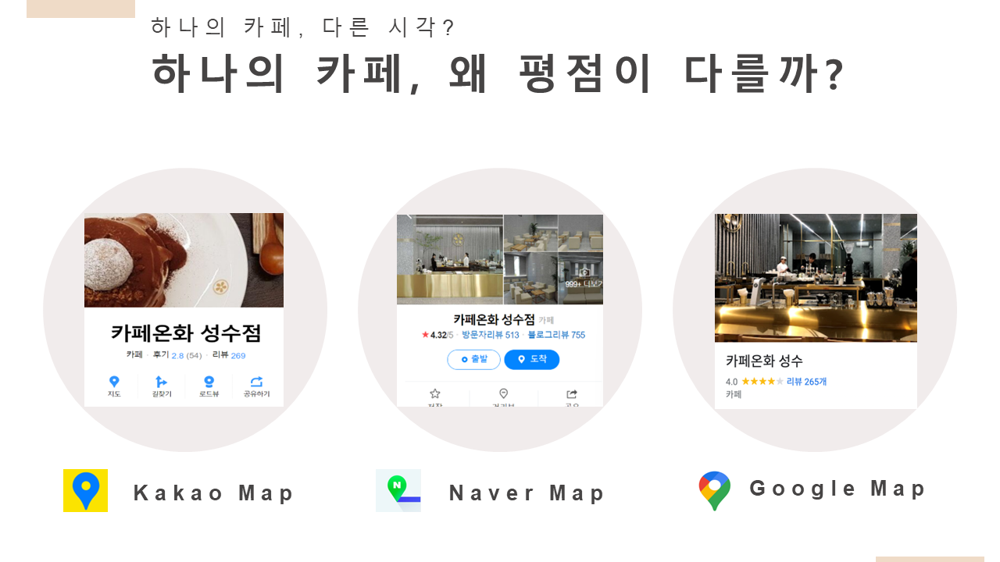
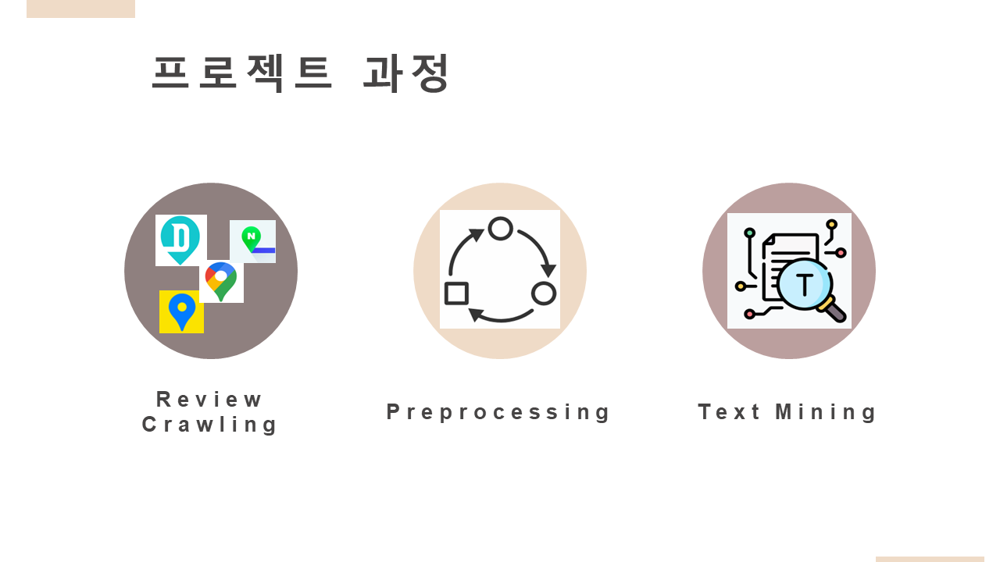
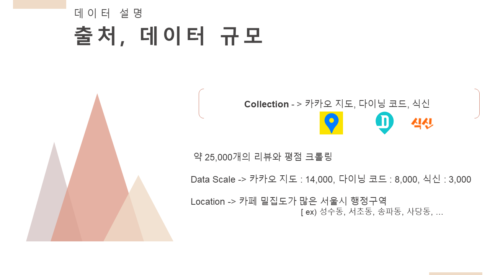

# Project Name : ☕ Cafe-reviews-To-Stars
 카페의 전체 리뷰들로부터 원하는 가게의 평점을 리뷰로 예측할 수 있게 해주는 프로젝트

## Contents Table
- [프로젝트 상세 내용](#프로젝트-상세-내용)
    - [문제 상황](#문제-상황)
    - [기대효과](#기대효과)
    - [Project 설명](#PROJECT-설명)
    - [활용 Dataset](#활용-Dataset)
- [사용 기술 및 라이브러리](#사용-기술-및-라이브러리)
- [담당한 부분](#담당한-부분) 
- [개발 환경](#Environment)
  

## 📖 프로젝트 상세 내용
### 문제 상황

- 원하는 식당이나 카페를 선정할 때 특정 지도 플랫폼의 평점, 리뷰는 중요한 역할을 담당한다.

- 지도 플랫폼을 확인해 보았을 때, 같은 가게에 대한 평점이 크게 다른 것을 볼 수 있다. 
-> 이는 사용자들이 광고성 리뷰를 제외한 내용들을 읽어야 가게를 선정할 수 있다는 것을 의미한다.

#### **원하는 지도 플랫폼에서 가게 이름으로부터 리뷰들을 얻고, 텍스트로부터 평균 평점을 에측해주는 모델을 만들자!**

### 기대효과 

- 가고싶은 가게를 선정할 때 리뷰내용을 바탕으로 평점을 계산하여 신뢰성이 있는 점수를 얻을 수 있다.
- 카페나 식당같은 가게 뿐만 아니라 원하는 장소의 평점을 얻을 수 있다.
- 텍스트 내용으로 에측하여 평점을 얻는 것이므로 객관적인 평가자료로 활용할 수 있어 가게 마케팅 용도로도 활용할 수 있다.

### PROJECT 설명 

원하는 지도 플랫폼을 선택할 수 있고, 가게 이름을 입력하면 Selenium을 이용한 리뷰가 크롤링되고, 불룡어 제거, 토큰화 과정의 전처리를 겪은 후 텍스트 내용으로 점수를 예측하고 점수들을 평균내어 결과를 도출하는 프로젝트

### 활용 Dataset

## 🛠️ 사용 기술 및 라이브러리
- Selenium
- Tensorflow
- Numpy, Pandas, Scikit-learn
- KoNLPy
- LightGBM, XGBoost

## 담당한 부분
- Selenium을 이용하여 '다이닝 코드'에서 학습 데이터를 위한 리뷰, 평점을 크롤링하는 코드 작성
- 데이터 전처리
- LightGBM 모델 학습
- 프로젝트 모델 구현을 위한 전체 Pipeline 구축

## 🗃️ Environment

| Env |CPU | GPU | RAM | OS 
|:--:|:--:|:--:|:--:|:--:|
| Local | i5- 10400F | RTX-3080(12G) | 32G| Window10 |
| AWS |  AMD-EPYC-7R32 | RTX-3090| 12G| Ubuntu |
| Colab + | intel Xeon | A100 | 80G | Ubuntu |
